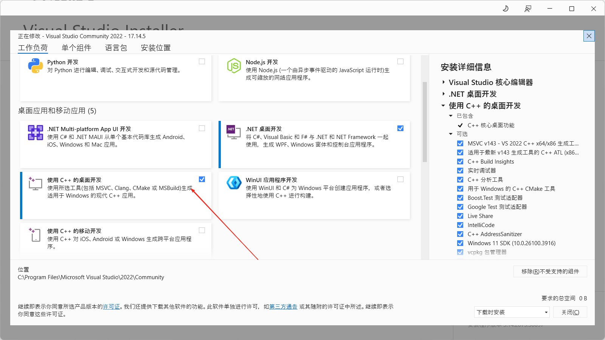
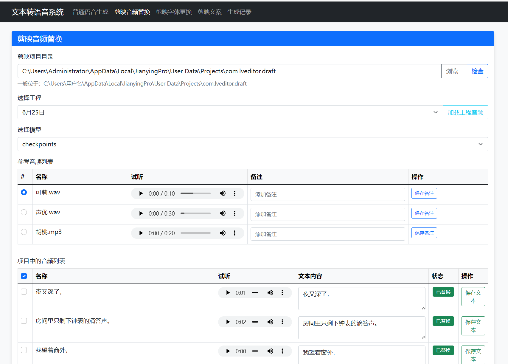
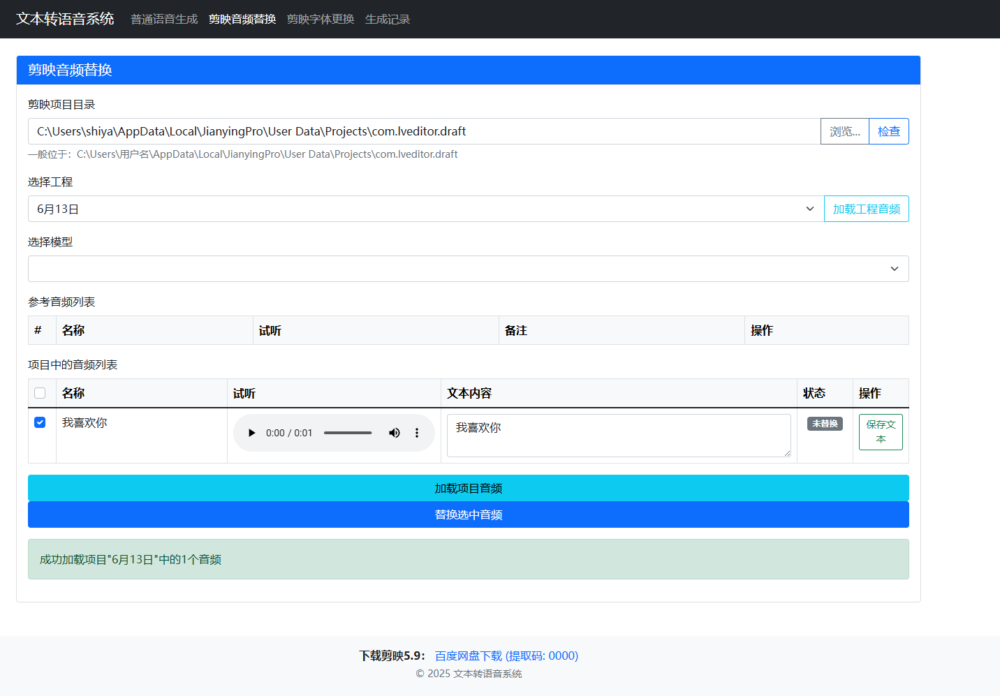
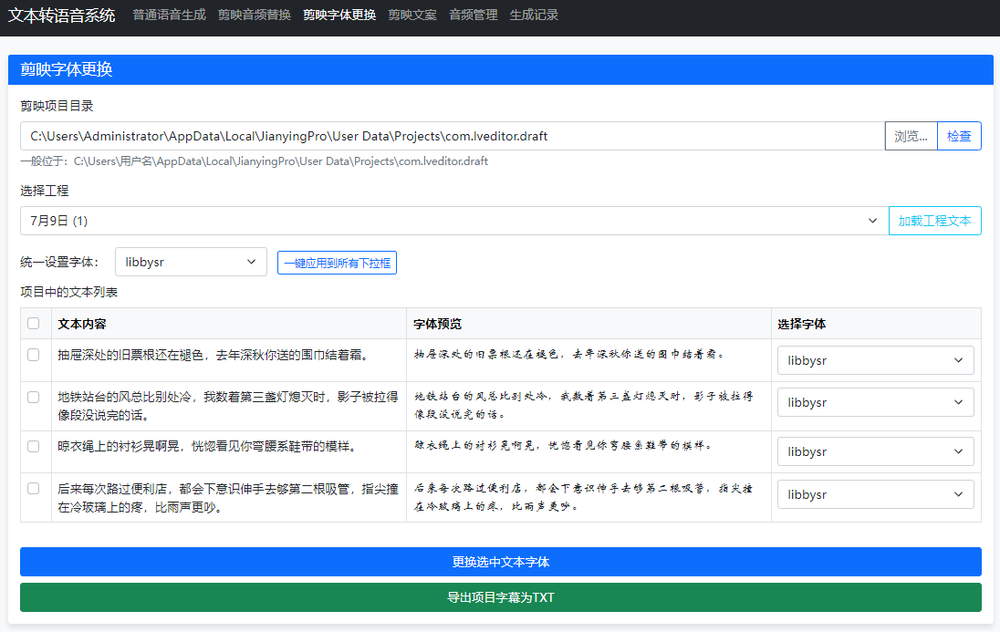
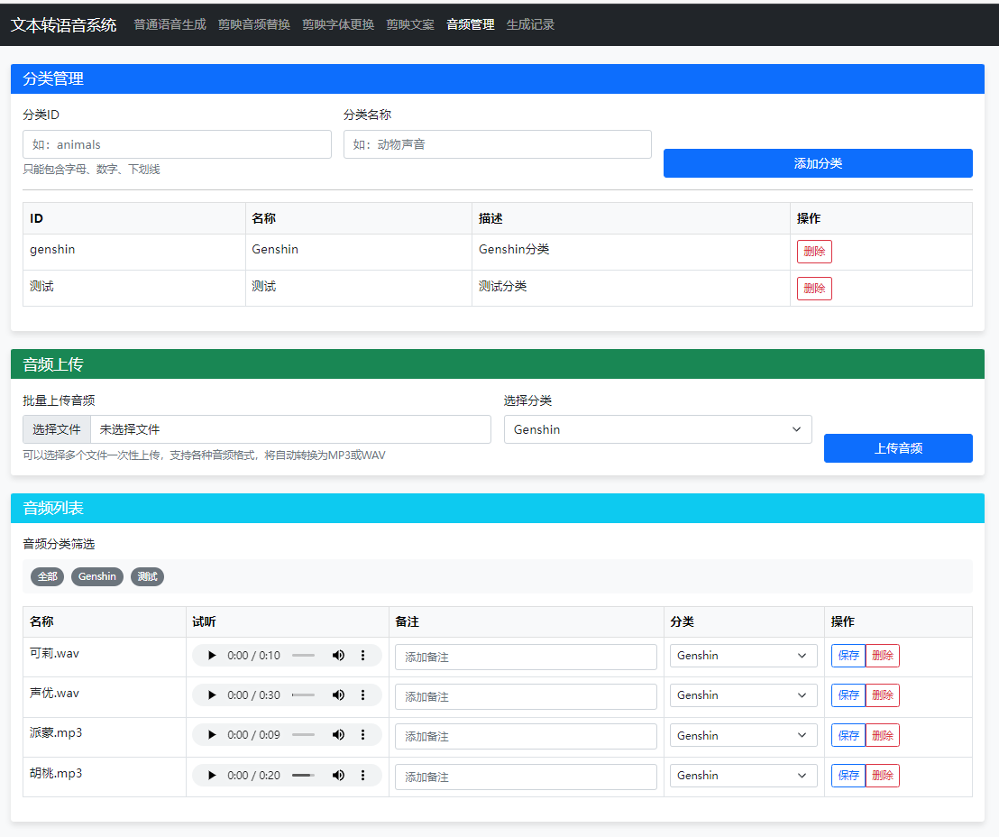
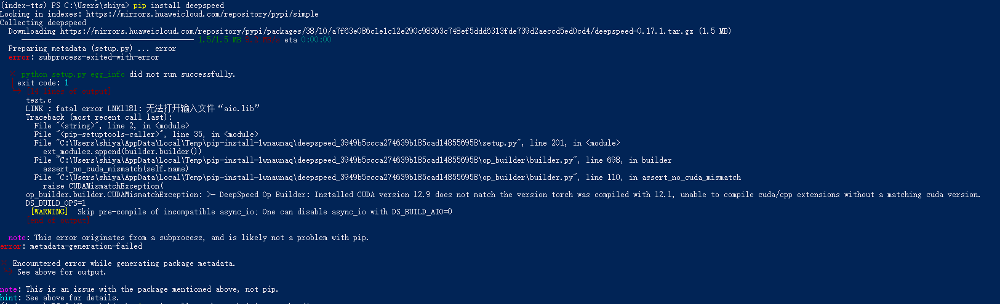

# 文本转语音系统 🎙️

<div align="center">


**基于Python Flask+剪映5.9的文本转语音Web应用程序，使用IndexTTS引擎实现语音合成功能**

</div>

## 📑 目录

- [项目简介](#项目简介)
- [资源下载](#资源下载)
- [功能特性](#功能特性)
- [项目结构](#项目结构)
- [系统依赖与安装](#系统依赖与安装)
- [运行方法](#运行方法)
- [使用教程](#使用教程)
  - [剪映替换教程](#剪映替换教程)
  - [去除伴奏教程](#去除伴奏教程)
- [常见问题](#常见问题)
- [交流方式](#交流方式)
- [赞赏支持](#赞赏支持)

## 📋 项目简介

在此感谢哔哩哔哩：

<div style="border: 1px solid #e0e0e0; border-radius: 8px; padding: 16px; margin: 10px 0; background-color: #f8f9fa;">
  <a href="https://github.com/index-tts/index-tts" target="_blank" style="text-decoration: none; color: #0969da; font-weight: bold;">
    index-tts
  </a>
  <p style="margin: 8px 0 0; color: #666;">IndexTTS 是一种主要基于 XTTS 和 Tortoise 的 GPT 风格的文本转语音 （TTS） 模型。它能够使用拼音纠正汉字的发音，并通过标点符号控制任何位置的停顿。我们增强了系统的多个模块，包括扬声器条件特征表示的改进，以及 BigVGAN2 的集成以优化音频质量。</p>
</div>

## 📥 资源下载

### 项目+模型
- **链接**：[https://pan.baidu.com/s/1DJFfS14bGSC0ZAq9E-rBMg](https://pan.baidu.com/s/1DJFfS14bGSC0ZAq9E-rBMg)
- **提取码**：6666

### 整合包（适合新手使用）
- **链接**：[https://pan.baidu.com/s/11mEIKEfWxmEW0r7nxbag0g](https://pan.baidu.com/s/11mEIKEfWxmEW0r7nxbag0g)
- **提取码**：6666

### 剪映5.9版本（必需）
- **链接**：[https://pan.baidu.com/s/1q6s2QVcP6F4MKm_qehJmXw](https://pan.baidu.com/s/1q6s2QVcP6F4MKm_qehJmXw)
- **提取码**：6666

> **注意**：本项目使用剪映版本为5.9，大于5.9的版本无法兼容使用

## ✨ 功能特性

- ✅ 选择不同的语音合成模型
- ✅ 选择参考音频作为语音风格参考
- ✅ 为参考音频添加备注信息
- ✅ 生成、预览和下载合成的语音文件
- ✅ 剪映的音频替换，解决以下问题：
  - 💰 无需付费订阅
  - 🔄 避免一次性付费使用浪费
  - 🎭 更丰富的音色选择
- ✅ 剪映的文字样式自定义（可以下载自定义TTF字体文件）

## 📂 项目结构

```
index-tts-jianying_zhb_V1.0.4/
├── app.py                    # 主应用程序入口
├── config.json               # 配置文件
├── draft_content.json        # 草稿内容配置
├── README.md                 # 项目说明文档
│
├── font/                     # 字体文件
├── model/                    # 模型文件
│   └── checkpoints/          # 检查点文件
│       ├── voice/            # 参考音频
│       └── ...               # 其他模型文件
│
├── records/                  # 记录文件
├── static/                   # 静态资源
│   ├── css/                  # 样式文件
│   ├── images/               # 图片资源
│   ├── js/                   # JavaScript文件
│   ├── output/               # 生成的音频输出
│   └── voice/                # 参考音频文件
│
├── templates/                # HTML模板
└── temp/                     # 临时文件夹
```

### 重要文件路径

| 路径 | 描述 |
|------|------|
| `static/voice` | 参考音频存放位置 |
| `static/output` | 生成的音频文件默认存放位置 |

## 🔧 系统依赖与安装

### 基础环境准备

1. **安装Anaconda**
   - 下载地址：[Anaconda官网](https://www.anaconda.com/download/success)
   - 安装时请勾选添加到环境变量选项

2. **安装CUDA**（有NVIDIA显卡的用户需要）
   - 下载地址：[CUDA Toolkit Archive](https://developer.nvidia.com/cuda-toolkit-archive)
   - ⚠️ **重要**：安装CUDA前先安装Visual Studio，否则会一直卡住
     
   - Visual Studio下载：[官网](https://visualstudio.microsoft.com/zh-hans/vs/)

### 环境配置步骤

1. **创建并激活conda环境**

```bash
# 创建Python 3.10环境
conda create -n index-tts python=3.10
# 激活环境
conda activate index-tts
```

2. **安装依赖项**

```bash
# 安装ffmpeg
conda install -c conda-forge ffmpeg

# 安装PyTorch和TorchAudio（根据CUDA版本选择对应命令）
# 可使用nvidia-smi查看CUDA版本
pip install torch torchaudio --index-url https://download.pytorch.org/whl/cu118

# 安装其他依赖
conda install -c conda-forge pynini==2.1.6
pip install WeTextProcessing --no-deps
pip install flask
pip install openai
```

3. **安装index-tts**

如果遇到以下错误：
```
ModuleNotFoundError: No module named 'indextts'
```

请执行：
1. 下载 [index-tts项目](https://github.com/index-tts/index-tts)
2. 解压后在终端中进入项目目录
3. 执行以下命令安装：
```bash
pip install -e .
```

## 🚀 运行方法

1. 确保已安装所有依赖
2. 检查模型文件是否已放置在 `model/checkpoints` 目录
3. 确认参考音频文件已放置在 `model/checkpoints/voice` 目录
4. 运行应用程序：

```bash
python app.py
```

5. 在浏览器中访问: `http://127.0.0.1:5000`

### 快速启动脚本

为了便于快速启动应用，您可以创建以下bat脚本（`start_tts.bat`）：

```bat
@echo off
echo 正在启动文本转语音系统...
echo.

REM 激活conda环境
call conda activate index-tts

REM 启动应用
python app.py

REM 如果应用意外关闭，暂停显示
pause
```

将此脚本保存在项目根目录下，双击即可快速启动应用。

1. 下载并安装FFmpeg

- 访问 https://ffmpeg.org/download.html 下载FFmpeg

- 或者从 https://github.com/BtbN/FFmpeg-Builds/releases 下载预编译的Windows版本

1. 安装步骤：

- 下载后解压到一个固定目录，如 C:\ffmpeg

- 将FFmpeg的bin目录（如 C:\ffmpeg\bin）添加到系统环境变量PATH中

1. 添加环境变量的方法：

- 右键点击"此电脑"→"属性"→"高级系统设置"→"环境变量"

- 在"系统变量"部分找到"Path"，点击"编辑"

- 添加FFmpeg的bin目录路径

- 点击"确定"保存设置

## 📚 使用教程

### 🎬 剪映替换教程

步骤：草稿中先使用任意内置声音朗诵（这样生成的音频位置会固定，便于替换）

<div align="center">

</div>

#### 普通语音生成

<div align="center">

</div>

#### 剪映字体替换

<div align="center">

</div>

#### 音频管理

<div align="center">

</div>

### 🎵 去除伴奏教程

推荐使用UVR5软件：[The Ultimate Vocal Remover Application](https://ultimatevocalremover.com/)

> **注意**：UVR5的模型在国外服务器，国内用户可能需要使用VPN下载

国内用户可以使用以下方式获取模型：
- 云兔VPN（价格较便宜且稳定）：[注册链接](https://vip.yuntu.blog/#/register?code=2rb4ZHij)
- 模型百度网盘链接：[下载链接](https://pan.baidu.com/s/1gdEvwbbreDKH8VEHO1SDVA?pwd=6666) 提取码: 6666

安装方法：
1. 右击UVR5图标
2. 打开文件所在位置
3. 将下载的model文件夹粘贴到此处

相关教程：
- [UVR5使用教程(CSDN)](https://blog.csdn.net/2301_79607161/article/details/135057915)
- [UVR5使用教程和最新连招(B站)](https://www.bilibili.com/opus/860174897353064448)

## ❓ 常见问题

### 1️⃣ CUDA安装缓慢

问题：安装CUDA特别慢  
解决方案：提前安装Visual Studio  
下载地址：[Visual Studio官网](https://visualstudio.microsoft.com/zh-hans/vs/)

### 2️⃣ DeepSpeed加载失败

问题：
```
>> DeepSpeed加载失败，回退到标准推理: No module named 'deepspeed'
```

解决方案（可选，不安装也能正常使用）：

```bash
# 禁用不兼容的DeepSpeed扩展
set DS_BUILD_AIO=0
set DS_BUILD_OPS=0

# 安装deepspeed
pip install deepspeed
```



> 注意：系统CUDA版本与PyTorch编译时的CUDA版本需匹配，可通过`nvidia-smi`查看系统CUDA版本

## 💬 交流方式

- QQ交流群：700598581
- 哔哩哔哩：[浅若红尘的个人空间](https://space.bilibili.com/519965290)
- 公众号：浅若红尘

## ❤️ 赞赏支持

如果这个项目帮助了你，欢迎：
- ⭐ 给项目点个Star
- 🍴 Fork项目并分享给有需要的朋友
- 提交Issue或PR反馈问题和建议

<div align="center">

</div>

<div align="center">


</div>
